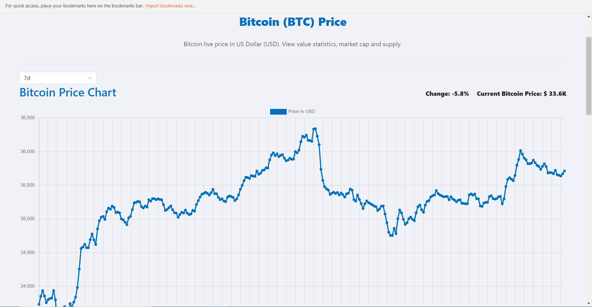
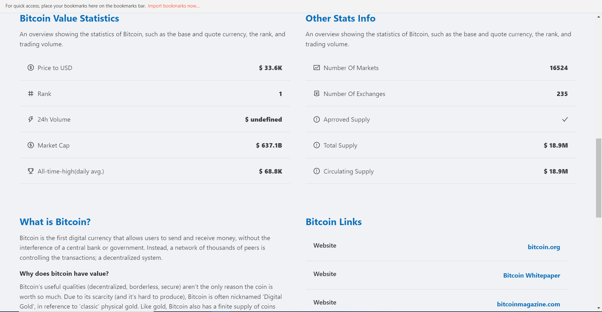

# Crypto Stats

➤ A platform where users can view and track the information everything regarding the Crypto World.
 
➤ Users can view general crypto market information and even detailed information about each cryptocurrency.
 
➤ Users can also see a graphical representation of crypto prices over a period of time.
 

 
 

 

 
 

## Installation and Setup Instructions

Clone down this repository. You will need node and npm installed globally on your machine.

Installation:
 
npm install

To Run Test Suite:
 
npm test

To Start Server:
 
npm start

To Visit App:
 
http://localhost:3000
 
 
 
